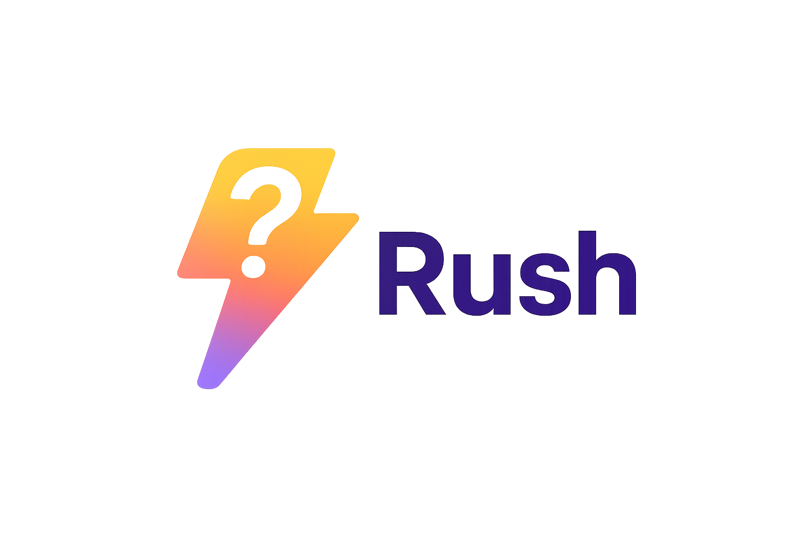

# 🎯 QRush - Interactive Quiz Platform

<p align="center">
  
</p>


QRush is an engaging, interactive quiz platform designed to test and expand your knowledge across various topics. Challenge yourself with multiple quiz formats, unlock achievements, and track your progress as you become a quiz master!

<p align="center">
  
  
  
  
  
  
</p>

## 🔗 Live Demo  
https://qrush-chi.vercel.app/

(Note: Signup/login may take a moment due to server cold starts.)

## 🎥 Video Demo

https://github.com/user-attachments/assets/c59c3a28-0f90-4dc0-a885-b409a0853d28


## 🌟 Features

### Quiz Types
- **Category Quizzes**: Test your knowledge in specific subjects like Science, Geography, Technology, and more
- **Finish the Type**: Complete phrases, names, and facts (Landmarks, Brands, Capitals, Facts, Inventors)
- **Identify from Image**: Guess objects, animals, landmarks, flags, and more from images
- **Escape Rooms**: Solve puzzles and riddles in themed escape room challenges

### Achievement System
- **Badge Collection**: Unlock badges for completing challenges and mastering different quiz types
- **Progress Tracking**: Monitor your completion rate and unlocked achievements
- **Rarity System**: Collect common, uncommon, rare, epic, and legendary badges

### User Experience
- **Responsive Design**: Optimized for desktop and mobile devices
- **Real-time Feedback**: Instant scoring and progress updates
- **Session Management**: Secure authentication with persistent login sessions
- **Modern UI**: Beautiful, animated interface built with React and Tailwind CSS

## 🛠️ Tech Stack

### Frontend
- **React 19** - Modern React with hooks and concurrent features
- **Vite** - Fast build tool and development server
- **Redux Toolkit** - State management with Redux Persist
- **React Router** - Client-side routing
- **Tailwind CSS** - Utility-first CSS framework
- **Framer Motion** - Animation library for smooth transitions
- **Axios / Fetch API** – For backend communication and API requests


### Backend
- **Node.js** - JavaScript runtime
- **Express.js** - Web application framework
- **MySQL** - Relational database
- **Express Session** - Session management
- **Bcrypt** - Password hashing
- **CORS** - Cross-origin resource sharing

## 🚀 Getting Started

### Prerequisites
- Node.js (v16 or higher)
- MySQL Server
- npm or yarn package manager

### Installation

1. **Clone the repository**
   ```bash
   git clone https://github.com/ansh-2609/qrush-website.git
   cd qrush-website
   ```

2. **Setup Backend**
   ```bash
   cd QRush-Backend
   npm install
   ```

3. **Setup Frontend**
   ```bash
   cd ../QRush-Frontend
   npm install
   ```

4. **Database Setup**
   - Create a MySQL database
   - Import the database schema from `QRush-Backend/db_backup/Dump20251205.sql`
   - Update database connection settings in backend configuration

5. **Backend Environment Variables**
   Create `.env` file in QRush-Backend directory:
   ```
   DB_HOST=localhost
   DB_USER=your_db_user
   DB_PASSWORD=your_db_password
   DB_NAME=qrush_db
   SESSION_SECRET=your_session_secret
   ABSTRACT_API_KEY=your_abstract_api_key  
   ```

6. **Frontend Environment Variables**
   Create a `.env` file in the `QRush-Frontend` directory:
   ```
   VITE_API_URL=http://localhost:8080   
   ```
### Running the Application

1. **Start Backend Server**
   ```bash
   cd QRush-Backend
   npm start
   ```
   Server will run on http://localhost:8080

2. **Start Frontend Development Server**
   ```bash
   cd QRush-Frontend
   npm run dev
   ```
   Frontend will run on http://localhost:5173

3. **Access the Application**
   Open your browser and navigate to http://localhost:5173

## 📁 Project Structure

```
QRush-Website/
├── QRush-Backend/           # Backend API server
│   ├── controllers/         # Route controllers
│   ├── models/             # Database models
│   ├── routes/             # API routes
│   ├── utils/              # Utility functions
│   └── app.js              # Main application file
├── QRush-Frontend/         # React frontend application
│   ├── public/             # Static assets
│   ├── src/
│   │   ├── components/     # React components
│   │   ├── services/       # API service functions
│   │   ├── store/          # Redux store and slices
│   │   ├── routes/         # Route components
│   │   └── main.jsx        # Application entry point
│   └── package.json
└── README.md
```

## 🎮 How to Play

1. **Sign Up/Login**: Create an account or login to track your progress
2. **Choose Quiz Type**: Select from various quiz categories and formats
3. **Answer Questions**: Test your knowledge and earn points
4. **Unlock Badges**: Complete challenges to unlock achievement badges
5. **Track Progress**: View your stats and completion rates

## 🏆 Badge System

Collect badges by:
- Completing quiz categories
- Achieving high scores
- Mastering different quiz types
- Participating in escape rooms

Badge rarities:
- 🟢 Common
- 🟡 Uncommon
- 🔵 Rare
- 🟣 Epic
- 🟠 Legendary


---

**Happy Quizzing! 🧠✨**

---
